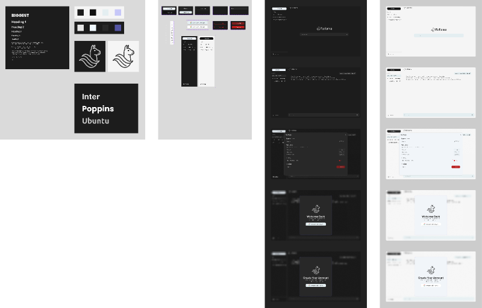
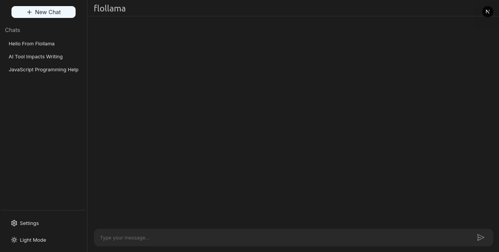

# 🦙 Flollama: Where Ideas Flow Freely

> A full-stack, open-access AI chatbot powered by Meta’s LLaMA 2.3 and built with Next.js — for everyone, free of cost.

---

## 📖 Overview

**Flollama** is a modern conversational AI chatbot developed by **[Pratyush Kumar](https://github.com/pratyush0898)**. Built using **Ollama**, **Meta's LLaMA 2.3**, and a sleek **Next.js interface**, it offers an open-source, privacy-respecting ChatGPT-style experience — ideal for students, creators, and casual users alike.

---

## 🚀 Tech Stack

| Layer            | Tools Used |
|------------------|------------|
| 🧠 AI Engine     | `Ollama`, `Meta LLaMA 2.3`, custom system prompt (`Makefile`) |
| 🌐 Frontend      | `Next.js 15`, `TailwindCSS 4`, `React`, `Shadcn UI` |
| ⚙️ Backend/API   | `Next.js API Routes`, `Node.js 24`, `npm 10`, `Turbopack` |
| 🔐 Auth & DB     | `Firebase Auth`, `Firestore Database` |
| ☁️ Hosting       | `Vercel`, `Google Cloud` |
| 🎨 Design        | `Figma` |
| 📂 Version Ctrl  | `Git`, `GitHub` |

---

## 🧩 Features

- 💬 LLaMA 2.3 powered AI chat via Ollama API
- 🌓 Light & Dark UI themes with Tailwind + Shadcn
- 🔐 Firebase Google Sign-In
- 📊 Chat history storage in Firestore
- ⚡ Superfast bundling with Turbopack
- 📱 Fully responsive, mobile-friendly
- 🌐 Deployable instantly with Vercel

---

## ☁️ Google Cloud Server Config

```txt
CPU     4 vCPU (e2-highcpu-4)
GPU     NVIDIA A2 12GB / GTX 1650
RAM     8 GB
SWAP    8 GB
DISK    50 GB SSD
OS      Debian 12 (Bookworm)
Cost    ≈ ₹16–₹21/hour
````

---

## 🔤 How to Pronounce "Flollama"

**Pronunciation:** `"flow-LAH-muh"`
**IPA:** `/floʊˈlɑːmə/`

| Part | Sounds Like            |
| ---- | ---------------------- |
| Flo  | “go” → /floʊ/          |
| Lla  | “la” in llama → /ˈlɑː/ |
| ma   | “muh” → /mə/           |

---

## 🎨 Brand Assets

### 🔘 Logos

* **Dark Mode Logo**
  

* **Light Mode Logo**
  

---

### 🎨 Color Palette

| Theme | Text      | Background | Primary   | Secondary | Accent    |
| ----- | --------- | ---------- | --------- | --------- | --------- |
| Light | `#1C1C1C` | `#FFFFFF`  | `#111111` | `#F1F5F9` | `#C6C7F8` |
| Dark  | `#FFFFFF` | `#1C1C1C`  | `#F0F8FF` | `#282828` | `#C6C7F8` |

### 🔤 Fonts

* **Primary UI Font:** Inter
* **Secondary Font:** Poppins
* **Logo Font:** Ubuntu

---

## 🎨 Figma Design

* [Figma UI Design](https://www.figma.com/design/bkghFG35GZG93T7vbrO1lj/Flollama)


---

## 🌐 Live Website

🔗 **[https://flollama.vercel.app/](https://flollama.vercel.app/)**


---

## 🤖 Large Language Model

🔗 **[Ollama Model Page](https://ollama.com/nvmpratyush/flollama)**


---

## 📘 License

Pratyush Non-Commercial License (PNCL) v2.0

© 2025 Pratyush Kumar

Use allowed for personal, educational, and non-commercial purposes only. Redistribution, commercialization, or false attribution is strictly prohibited. You must retain author credits in all copies or forks.

For full license terms, see [LICENSE](LICENSE).

---

## ✅ Conclusion

**Flollama** isn’t just a chatbot — it's proof that solo developers can build powerful AI tools that are **open**, **accessible**, and **beautifully designed**.

Built with ❤️ by [Pratyush Kumar](https://nvmpratyush.vercel.app/), Flollama is your friendly, fast, and free AI assistant. Ask questions, spark ideas, or just chat — anytime, anywhere.

---

> ✨ *If you find this project useful, don’t forget to ⭐ star the repo and share it with others!*
